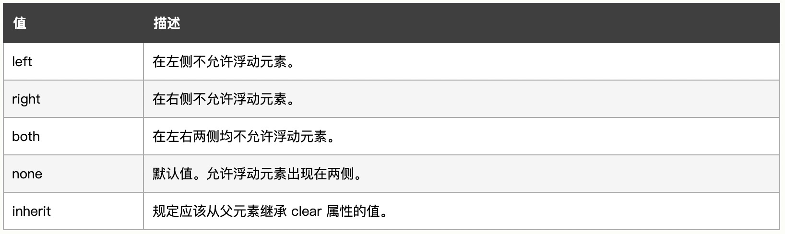

 
# 浮动
+ 清除浮动的方法
+ 以下能够清除浮动的是：  
> 空div  
hover伪选择器  
clear属性  
overflow属性
<!-- more -->
## 浮动出现的背景
最初是为了实现“文字环绕”，让文字环绕图片。  
由于包裹文字的p元素是块级元素，会独占一行。  
只需要设置图片元素的浮动即可。  
::: normal-demo 代码演示

```html
<!-- html code -->
<div class="container">
  
  <p>Lorem, ipsum dolor sit amet consectetur adipisicing elit. Doloribus quos est rerum repellat alias maiores
    nobis harum recusandae corrupti assumenda qui aut ipsam deserunt dolorem modi, culpa hic ex illo repellendus
    atque. Numquam iste porro perspiciatis. Harum esse magni exercitationem, perspiciatis libero soluta quo ea
    dolorem. Delectus tempore magnam vitae voluptatibus, non quasi laudantium, aliquam consequuntur perspiciatis
    maiores esse neque animi voluptate. Animi pariatur debitis quam aliquam recusandae quis ut nisi totam sint
    consectetur distinctio, quos saepe cum quo iure natus delectus! Ad, dolore. Ut temporibus ea autem fugiat
    laboriosam quidem iste rerum laborum. Repellendus recusandae sequi id excepturi alias?</p>
</div>
```

```js
// js code

```

```css
/* css code */
.img {
  width: 200px;
  height: 200px;
  border: 1px solid #ccc;
  float: left;
}
```

:::
当设置了图片浮动以后，就出现了类似 word 里 文字环绕的效果。

## 浮动实现布局
随着网页技术发展，人们发现只使用 行内元素、块级元素，这种方式没有办法做页面布局， 比如想让两个块级元素在一行。  
此时就可以用浮动了，不在仅限于使用在图片上了。

## 浮动的特性

### 1. 脱离标准流
::: normal-demo 代码演示

```html
<!-- html code -->
<div class="one"></div>
<div class="two"></div>
```
```css
/* css code */
.one {
  width: 80px;
  height: 80px;
  background-color: red;
  float: left;
}

.two {
  width: 150px;
  height: 150px;
  background-color: blue;
}
```
:::
蓝色盒子为什么往上走了，因为红色设置浮动后脱离了标准流。

### 2. 浮动的元素相互贴靠
如果有多个浮动的元素，它们会互相贴靠。
::: normal-demo 代码演示

```html
<!-- html code -->
<div class="one"></div>
<div class="two"></div>
```
```css
/* css code */
.one {
  width: 80px;
  height: 80px;
  background-color: red;
  float: left;
}

.two {
  width: 150px;
  height: 150px;
  background-color: blue;
  float: left;
}
```
:::  

但是如果一排的宽度不够，浮动的元素们就不再贴靠，而是下面的元素另起一行。
### 3. 宽度收缩
如果块级元素没有设置宽度的话，正常情况下宽度默认为100%独占一行。 这时候如果设置浮动的话，宽度会根据元素内容收缩。

## 清除浮动
有些时候，浮动会带来副作用，需要清除
::: normal-demo 代码演示

```html
<!-- html code -->
<ul>
  <li>导航1</li>
  <li>导航2</li>
  <li>导航3</li>
</ul>
<ul>
  <li>游戏</li>
  <li>动漫</li>
  <li>音乐</li>
</ul>
```
```js
// js code

```
```css
/* css code */
li {
  float: left;
  width: 100px;
  height: 20px;
  background-color: pink;
}
```
:::
在上面的示例中，我们本来是打算做两个导航栏的，但是由于浮动的贴靠性质，导致所有的 li 都在一行了。

这个时候我们就需要一些方式来清除浮动。

### 1. 给父元素设置高度
注意，给父元素设置高度时，这个高度值一定要大于浮动子元素的高度，这样才能把浮动的子元素“关在”父元素里。

### 2. clear属性
但是在实际开发中，很多时候父元素的高度都是由内容撑开的，有些时候就不会设置高度。可以使用clear属性。


但是clear也有缺陷： 会使margin属性失效。

### 3. 隔墙法
原理： 在两个浮动的元素中间添加一个空元素，然后给这个空元素设置 `clear: both;`，让空元素的左右都不允许出现浮动，这样就可以了。
但是这样会在HTML代码中添加额外的无意义代码，而且，如果不给父元素设置高度的话，子元素浮动，就撑不开父元素了，父元素的高度会变成0。  

### 4. overflow属性
本来是用来处理溢出内容的显示方式的。
当给父元素设置 `overflow: hidden;` 之后，父元素会形成一个BFC，一块独立的显示区域，不受外界影响，也可以清除浮动。

### 5. 伪类清除法（主流方案）
为父元素设置一个伪元素，其实就是添加了一堵墙，然后设置伪元素的一系列属性
```css
.clearfix::after {
  content: '';
  display: block;
  height: 0;
  clear: both;
  visibility: hidden;
}
```

## 浮动的现状
除非要考虑开发古老的IE6/7，否则布局有更好的弹性盒、网格布局等，float使用越来越少。