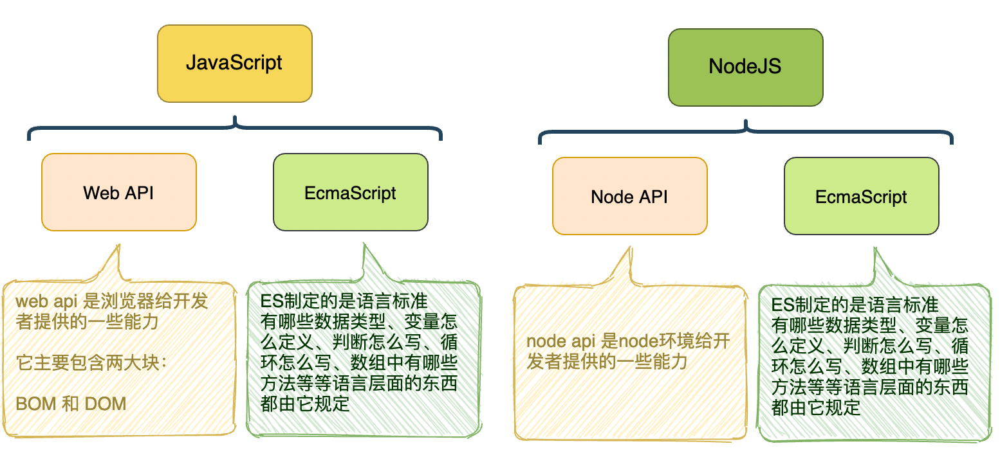

## 为什么需要模块化

当前端工程到达一定规模后，就会出现下面的问题：

- 全局变量污染

- 依赖混乱

上面的问题，共同导致了**代码文件难以细分**

模块化就是为了解决上面两个问题出现的

模块化出现后，我们就可以把臃肿的代码细分到各个小文件中，便于后期维护管理

## 前端模块化标准

前端主要有两大模块化标准：

- CommonJS，简称CMJ，这是一个**社区**规范，出现时间较早，目前仅node环境支持
- ES Module，简称ESM，这是随着ES6发布的**官方**模块化标准，目前浏览器和新版本node环境均支持

