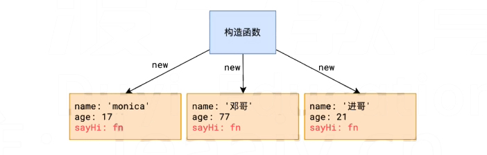
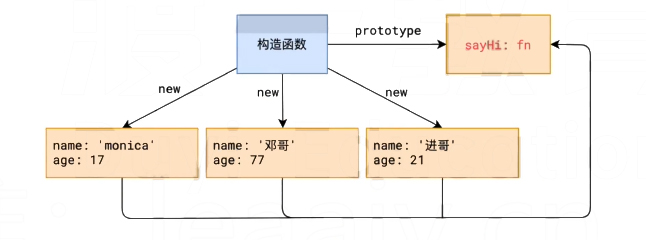
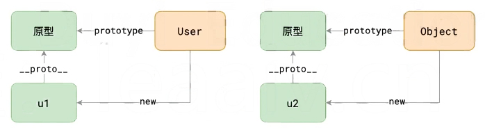
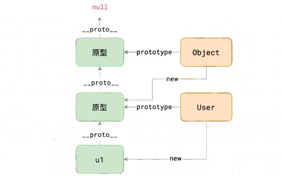
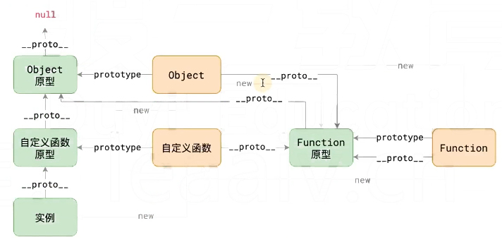

 
# 原型
在JS中，原型是一个非常基础也非常重要的概念，一定要吃透。
<!-- more -->

## 构造函数
我们先从构造函数入手
``` javascript
// 假设创建一个对象 人
var person = {
  firstname: '张',
  lastname: '三',
  // 对象 方法
  sayHi: function() {
    console.log('我的名字叫：' + person.fullname);
  }
};
person.fullname = person.firstname + person.lastname;
// person.sayHi();

/*
但是程序里面不可能只有一个人，会创建很多人
所以就写一个构造函数，把一些预设的操作写好，可以很方便的创建人
*/
function Person(firstName, lastName) {
  // var this = {};

  this.firstName = firstName;
  this.lastName = lastName;
  this.fullName = firstName + lastName;
  this.sayHi = function () {
    console.log('我的名字叫做：' + this.fullName);
  };

  // return this;
}

// var person1 = new Person('张', '三三');
// person1.sayHi();

// var person2 = new Person('李', '四');
// person2.sayHi();
```

##  原型要解决的问题



上图中，通过构造函数可以创建一个用户对象

这种做法有一个严重的缺陷，就是每个用户对象中都拥有一个`sayHi`方法，对于每个用户而言，`sayHi`方法是完全一样的，没必要为每个用户单独生成一个。

要解决这个问题，必须学习原型

## 原型是如何解决的


1. **原型**

   每个函数都会自动附带一个属性`prototype`，这个属性的值是一个普通对象，称之为原型对象

2. **实例**

   instance，通过`new`产生的对象称之为实例。

   > 由于JS中所有对象都是通过`new`产生的，因此，严格来说，JS中所有对象都称之为实例

3. **隐式原型**

   每个实例都拥有一个特殊的属性`__proto__`，称之为隐式原型，它指向构造函数的原型


这一切有何意义？

**当访问实例成员时，先找自身，如果不存在，会自动从隐式原型中寻找**

**这样一来，我们可以把那些公共成员，放到函数的原型中，即可被所有实例共享**



```javascript
/*
原型也是数据表达相关知识，是构造函数的延伸
*/
function User(name, age) {
  this.name = name;
  this.age = age;
  /* 如果这么写方法的话，会导致所有new出来的对象里面都有一个sayHi方法
      函数体本身没有必要一样，每个对象的方法都会使用不同的内存空间，浪费
  */
  // this.sayHi = function() {
  //   console.log('你好，我是' + this.name + '，今年' + this.age + '岁了');
  // }
}

User.prototype.sayHi = function () {
  console.log('你好，我是' + this.name + '，今年' + this.age + '岁了');
};

var u1 = new User('monica', 17);
var u2 = new User('邓哥', 77);
var u3 = new User('成哥', 18);

console.log(u1, u2, u3); // u1 u2 u3 就是实例instance

console.log(User.prototype === u1.__proto__);  // true
```

## this

不同的场景，**这** 指代的含义不同，JS中的**this**关键字也是如此：

- 在全局代码中使用this，指代全局对象

  > 在真实的开发中，很少在全局代码使用this

- **在函数中使用this，它的指向完全取决于函数是如何被调用的**

  | 调用方式         | 示例                | 函数中的this指向  |
  | ---------------- | ------------------- | ----------------- |
  | **通过new调用**  | `new method()`      | 新对象            |
  | **直接调用**     | `method()`          | 全局对象          |
  | **通过对象调用** | `obj.method()`      | 前面的对象        |
  | **call**         | `method.call(ctx)`  | call的第一个参数  |
  | **apply**        | `method.apply(ctx)` | apply的第一个参数 |
  |                  |                     |                   |

``` javascript
// !! 在函数中使用this，它的指向完全取决于函数是如何被调用的

function User() {
  console.log(this);
}

// 通过new调用
new User(); // // [object Object]  {}
// 直接调用
User(); // Window

var obj = {
  a: 1, b: 2,
  method: function() {
    console.log(this);
  },
  c: {
    m: function() {
      console.log(this);
    }
  }
}

// 通过对象调用
obj.method(); // [object Object] { "a": 1, "b": 2, "method": function () {   console.log(this); } }
obj.c.m(); // [object Object] { "m": function () { console.log(this); }}

// 直接调用
var m2 = obj.c.m;
m2(); // Window  


// call 、 apply
function m(a, b) {
  console.log(this, a, b);
}
var arr = {name: '我是arr'};
// m.call(arr, 1, 2); // 调用m函数，让它里面的this指向arr
m.apply(arr, [1, 2]); // { "name": "我是arr" } 1 2


/*
hasOwnProperty
in
*/
Object.prototype.abc = 1;
var obj = {
  a: 1,
  b: 2,
};
// console.log(obj.hasOwnProperty('abc'));

// 属性名 in 对象  ---> 判断 属性名 是否在对象自身及其隐式原型上
// console.log('abc' in obj);

// for (var key in obj) {
//   // 判断这个属性是不是属于对象本身，而不是在隐式原型上
//   if (obj.hasOwnProperty(key)) {
//     console.log(key);
//   }
// }

// 练习题
function User(firstName, lastName) {
  this.firstName = firstName;
  this.lastName = lastName;
  this.fullName = firstName + lastName;
}

// 能否不使用new，通过User函数创建对象（不能更改User函数）
var u = {};
User.call(u, '张', '三');
console.log(u);
// [object Object]  { "firstName": "张", "lastName": "三", "fullName": "张三" }
```

## 什么是原型链

**所有的对象都是通过`new 函数`的方式创建的**

```js
var u1 = new User('张', '三'); // 对象 u1 通过 new User 创建
var u2 = { // 对象 u2 通过 new Object 创建
  firstName: '李',
  lastName: '小龙'
}
// 等效于
var u2 = new Object(); 
u2.firstName = '李';
u2.lastName = '小龙';
```

上面的代码形成的原型图如下



原型对象本身也是一个对象，默认情况下，是通过`new Object`创建的，因此，上面的两幅原型图是可以发生关联的



> `Object.prototype.__proto__`比较特殊，它固定指向null

可以看出，u1的隐式原型形成了一个链条，称之为**原型链**

当读取对象成员时，会先看对象自身是否有该成员，如果没有，就**依次在其原型链上查找**

## 完整的链条



## 对开发的影响

### 在原型上更改会产生多大影响

更改构造函数的原型会对所有原型链上有该构造函数的原型的对象产生影响

### 学会利用原型链判断类型

1. `instanceof`关键字【常用】

   ```js
   object instanceof constructor
   // 判断object的原型链中，是否存在constructor的原型
   ```

2. `Object.getPrototypeOf()`【不常用】

   ```js
   Object.getPrototypeOf(object);
   // 返回object的隐式原型
   ```

### 学会创建空原型的对象

1. 利用`Object.create()`

   ```js
   Object.create(target);
   // 返回一个新对象，新对象以target作为隐式原型
   ```

2. 利用`Object.setPrototypeOf()`

   ```js
   Object.setPrototypeOf(obj, prototype);
   // 设置obj的隐式原型为prototype
   ```

``` javascript
// 函数也是特殊的对象
function sum(a, b) {
  return a + b;
}
// 上面的函数声明等价于下面写法
var sum = new Function('a', 'b', 'return a + b');

// Object.prototype === Object.__proto__.__proto__ // true
// Object.prototype 里面加的东西会影响所有对象、函数
// Function.prototype 里面加的东西只会影响函数


/*
面试题
*/
// 下面的代码输出什么？
function User() {}
User.prototype.sayHello = function () {};

var u1 = new User();
var u2 = new User();

console.log(u1.sayHello === u2.sayHello); // true
console.log(User.prototype === Function.prototype); // false
console.log(User.__proto__ === Function.prototype); // true
console.log(User.__proto__ === Function.__proto__); // true
console.log(u1.__proto__ === u2.__proto__); // true
console.log(u1.__proto__ === User.__proto__); // false
console.log(Function.__proto__ === Object.__proto__); // true
console.log(Function.prototype.__proto__ === Object.prototype.__proto__); // false
console.log(Function.prototype.__proto__ === Object.prototype); // true
```