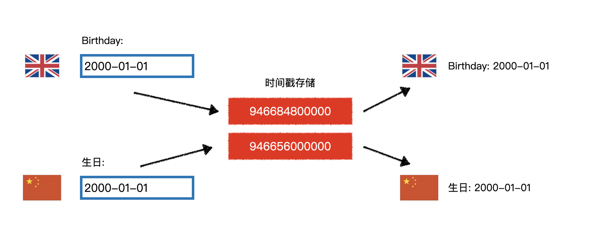

 
# 标准库
库 Library
API Application Program Interface - 应用程序编程接口
<!-- more -->

## 包装类
如果尝试着把原始类型（number、string、boolean）当做对象使用，JS会自动将其转换为对应包装类的实例

### Number
[https://developer.mozilla.org/zh-CN/docs/Web/JavaScript/Reference/Global_Objects/Number](https://developer.mozilla.org/zh-CN/docs/Web/JavaScript/Reference/Global_Objects/Number)

| API | 含义 | 备注 |
| --- | --- | --- |
| [Number.NaN](https://developer.mozilla.org/zh-CN/docs/Web/JavaScript/Reference/Global_Objects/Number/NaN) | 表示一个数学上并不存在的数字 | 可以直接书写为`NaN` |
| [Number.isNaN()](https://developer.mozilla.org/zh-CN/docs/Web/JavaScript/Reference/Global_Objects/Number/isNaN) | 判断传入的值是否是NaN | 可以直接书写为`isNaN` |
| [Number.isInteger()](https://developer.mozilla.org/zh-CN/docs/Web/JavaScript/Reference/Global_Objects/Number/isInteger) | 判断传入的值是否是整数 | |
| [Number.parseInt()](https://developer.mozilla.org/zh-CN/docs/Web/JavaScript/Reference/Global_Objects/Number/parseInt) | 把传入的值转换为整数形式返回 | 可以直接书写为`parseInt()` |
| [Number.parseFloat()](https://developer.mozilla.org/zh-CN/docs/Web/JavaScript/Reference/Global_Objects/Number/parseFloat) | 把传入的值转换为小数形式返回 | 可以直接书写为`parseFloat()` |
| [Number.prototype.toFixed()](https://developer.mozilla.org/zh-CN/docs/Web/JavaScript/Reference/Global_Objects/Number/toFixed) | 将当前数字保留指定位数的小数返回 | 传入小数位数 |
| [Number.prototype.toString()](https://developer.mozilla.org/zh-CN/docs/Web/JavaScript/Reference/Global_Objects/Number/tostring) | 将当前数字转换为字符串返回 | 传入进制2-36 |


### String


[https://developer.mozilla.org/zh-CN/docs/Web/JavaScript/Reference/Global_Objects/String](https://developer.mozilla.org/zh-CN/docs/Web/JavaScript/Reference/Global_Objects/String)

| API | 含义 | 备注 |
| --- | --- | --- |
| [String.fromCharCode()](https://developer.mozilla.org/zh-CN/docs/Web/JavaScript/Reference/Global_Objects/String/fromCharCode) | 根据编码值得到一个字符 | 传入一个或多个编码值 |
| [String.prototype.length](https://developer.mozilla.org/zh-CN/docs/Web/JavaScript/Reference/Global_Objects/String/length) | 得到字符串的长度 | |
| [String.prototype.charCodeAt()](https://developer.mozilla.org/zh-CN/docs/Web/JavaScript/Reference/Global_Objects/String/charCodeAt) | 得到某个下标的字符编码 | 传入下标 |
| [String.prototype.includes()](https://developer.mozilla.org/zh-CN/docs/Web/JavaScript/Reference/Global_Objects/String/includes) | 判断当前字符串是否包含某个子串 | 传入子串 |
| [String.prototype.indexOf()](https://developer.mozilla.org/zh-CN/docs/Web/JavaScript/Reference/Global_Objects/String/indexOf) | 判断某个字符串在当前字符串中的第一个下标位置 | 如果没有，返回-1 |
| [String.prototype.lastIndexOf()](https://developer.mozilla.org/zh-CN/docs/Web/JavaScript/Reference/Global_Objects/String/lastIndexOf) | 判断某个字符串在当前字符串中的最后一个下标位置 | 如果没有，返回-1 |
| [String.prototype.endsWith()](https://developer.mozilla.org/zh-CN/docs/Web/JavaScript/Reference/Global_Objects/String/endsWith) | 判断某个字符串是否以指定的字符串结束 | 传入一个字符串 |
| [String.prototype.startsWith()](https://developer.mozilla.org/zh-CN/docs/Web/JavaScript/Reference/Global_Objects/String/startsWith) | 判断某个字符串是否以指定的字符串开始 | 传入一个字符串 |
| [String.prototype.padStart()](https://developer.mozilla.org/zh-CN/docs/Web/JavaScript/Reference/Global_Objects/String/padStart) | 将当前的字符串按照指定的字符在字符串开始位置填充到指定的位数，返回填充后的字符串 | 传入位数、填充字符 |
| [String.prototype.padEnd()](https://developer.mozilla.org/zh-CN/docs/Web/JavaScript/Reference/Global_Objects/String/padEnd) | 将当前的字符串按照指定的字符在字符串结束位置填充到指定的位数，返回填充后的字符串 | 传入位数、填充字符 |
| [String.prototype.split()](https://developer.mozilla.org/zh-CN/docs/Web/JavaScript/Reference/Global_Objects/String/split) | 把当前字符串按照某个字符串分割成一个字符串数组返回 | 传入分隔符 |
| [String.prototype.substring()](https://developer.mozilla.org/zh-CN/docs/Web/JavaScript/Reference/Global_Objects/String/substring) | 返回一个字符串在开始索引到结束索引之间的一个子集, 或从开始索引直到字符串的末尾的一个子集 | 传入开始字符、结束字符 |
| [String.prototype.trim()](https://developer.mozilla.org/zh-CN/docs/Web/JavaScript/Reference/Global_Objects/String/Trim) | 从字符串的两端删除空白字符，返回新字符串 | 无参数 |
| [String.prototype.trimStart()](https://developer.mozilla.org/zh-CN/docs/Web/JavaScript/Reference/Global_Objects/String/trimStart) | 从字符串的开头删除空白字符，返回新字符串 | 无参数 |
| [String.prototype.trimEnd()](https://developer.mozilla.org/zh-CN/docs/Web/JavaScript/Reference/Global_Objects/String/trimEnd) | 从字符串的末端删除空白字符，返回新字符串 | 无参数 |
| [String.prototype.toUpperCase()](https://developer.mozilla.org/zh-CN/docs/Web/JavaScript/Reference/Global_Objects/String/toUpperCase) | 将调用该方法的字符串转为大写形式并返回 | 无参数 |
| [String.prototype.toLowerCase()](https://developer.mozilla.org/zh-CN/docs/Web/JavaScript/Reference/Global_Objects/String/toLowerCase) | 将调用该方法的字符串转为小写形式并返回 | 无参数 |
| [String.prototype.replace()](https://developer.mozilla.org/zh-CN/docs/Web/JavaScript/Reference/Global_Objects/String/replace) | 替换字符串中的第一个对应字符为新字符 | |
| [String.prototype.replaceAll()](https://developer.mozilla.org/zh-CN/docs/Web/JavaScript/Reference/Global_Objects/String/replaceall) | 替换字符串中的所有对应字符为新字符 | |


## 数学


[https://developer.mozilla.org/zh-CN/docs/Web/JavaScript/Reference/Global_Objects/Math](https://developer.mozilla.org/zh-CN/docs/Web/JavaScript/Reference/Global_Objects/Math)

| API | 含义 | 备注 |
| --- | --- | --- |
| [Math.PI](https://developer.mozilla.org/zh-CN/docs/Web/JavaScript/Reference/Global_Objects/Math/PI) | 得到圆周率π | |
| [Math.abs()](https://developer.mozilla.org/zh-CN/docs/Web/JavaScript/Reference/Global_Objects/Math/abs) | 求某个数绝对值 | 传入一个数 |
| [Math.ceil()](https://developer.mozilla.org/zh-CN/docs/Web/JavaScript/Reference/Global_Objects/Math/ceil) | 向上取整 | 传入一个数 |
| [Math.floor()](https://developer.mozilla.org/zh-CN/docs/Web/JavaScript/Reference/Global_Objects/Math/floor) | 向下取整 | 传入一个数 |
| [Math.max()](https://developer.mozilla.org/zh-CN/docs/Web/JavaScript/Reference/Global_Objects/Math/max) | 求一个数列中的最大值 | 把数列依次传入 |
| [Math.min()](https://developer.mozilla.org/zh-CN/docs/Web/JavaScript/Reference/Global_Objects/Math/min) | 求一个数列中的最小值 | 把数列依次传入 |
| [Math.random()](https://developer.mozilla.org/zh-CN/docs/Web/JavaScript/Reference/Global_Objects/Math/random) | 得到一个0-1之间的随机小数 | 无参；无法取到1 |
| [Math.round()](https://developer.mozilla.org/zh-CN/docs/Web/JavaScript/Reference/Global_Objects/Math/round) | 返回四舍五入的结果 | 传入一个数 |


## 日期


### 时间基础知识


#### 单位
| 单位 | 名称 | 换算 |
| --- | --- | --- |
| hour | 小时 | 1 day = 24 hours |
| minute | 分钟 | 1 hour = 60 minutes |
| second | 秒 | 1 minute = 60 seconds |
| millisecond （ms） | 毫秒 | 1 second = 1000 ms |
| nanosecond （ns） | 纳秒 | 1 ms = 1000 ns |


#### GMT和UTC


世界划分为24个时区，北京在东8区，格林威治在0时区。


**GMT**：Greenwish Mean Time 格林威治世界时。太阳时，精确到毫秒。


**UTC**：Universal Time Coodinated 世界协调时。以原子时间为计时标准，精确到纳秒。


> 国际标准中，已全面使用UTC时间，而不再使用GMT时间
>


GMT和UTC时间在文本表示格式上是一致的，均为`星期缩写, 日期 月份 年份 时间 GMT`，例如：


```plain
Thu, 27 Aug 2020 08:01:44 GMT
```


另外，ISO 8601标准规定，建议使用以下方式表示时间：


```plain
YYYY-MM-DDTHH:mm:ss.msZ
例如：
2020-08-27T08:01:44.000Z
```


**GMT、UTC、ISO 8601都表示的是零时区的时间**


#### Unix 时间戳


> Unix 时间戳（Unix Timestamp）是Unix系统最早提出的概念
>


它将UTC时间1970年1月1日凌晨作为起始时间，到指定时间经过的秒数（毫秒数）


#### 程序中的时间处理


**程序对时间的计算、存储务必使用UTC时间，或者时间戳**


**在和用户交互时，将UTC时间或时间戳转换为更加友好的文本**





思考下面的问题：


1. 用户的生日是本地时间还是UTC时间？
2. 如果要比较两个日期的大小，是比较本地时间还是比较UTC时间？
3. 如果要显示文章的发布日期，是显示本地时间还是显示UTC时间？
4. `北京时间2020-8-28 10:00:00`和`格林威治2020-8-28 02:00:00`，两个时间哪个大，哪个小？
5. `北京的时间戳为0`和`格林威治的时间戳为0`，它们的时间一样吗？
6. 一个中国用户注册时填写的生日是`1970-1-1`，它出生的UTC时间是多少？时间戳是多少？


### 日期API


[https://developer.mozilla.org/zh-CN/docs/Web/JavaScript/Reference/Global_Objects/Date](https://developer.mozilla.org/zh-CN/docs/Web/JavaScript/Reference/Global_Objects/Date)


构造函数：


```javascript
new Date(); // 得到一个当前日期对象
new Date(value); // 根据时间戳得到一个日期对象
new Date(dateString); // 根据一个标准日期字符串得到一个日期对象
new Date(year, monthIndex [, day [, hours [, minutes [, seconds [, milliseconds]]]]]); // 根据年、月、日、小时、分钟、秒、毫秒得到一个日期对象
```

| API | 含义 | 备注 |
| --- | --- | --- |
| [Date.now()](https://developer.mozilla.org/zh-CN/docs/Web/JavaScript/Reference/Global_Objects/Date/now) | 得到当前时间戳 | 无参 |
| [Date.prototype.getFullYear()](https://developer.mozilla.org/zh-CN/docs/Web/JavaScript/Reference/Global_Objects/Date/getFullYear) | 得到年 | 无参；本地时间； |
| [Date.prototype.getMonth()](https://developer.mozilla.org/zh-CN/docs/Web/JavaScript/Reference/Global_Objects/Date/getMonth) | 得到月 | 无参；本地时间；范围0-11 |
| [Date.prototype.getDate()](https://developer.mozilla.org/zh-CN/docs/Web/JavaScript/Reference/Global_Objects/Date/getDate) | 得到日 | 无参；本地时间； |
| [Date.prototype.getHours()](https://developer.mozilla.org/zh-CN/docs/Web/JavaScript/Reference/Global_Objects/Date/getHours) | 得到小时 | 无参；本地时间； |
| [Date.prototype.getMinutes()](https://developer.mozilla.org/zh-CN/docs/Web/JavaScript/Reference/Global_Objects/Date/getMinutes) | 得到分钟 | 无参；本地时间； |
| [Date.prototype.getSeconds()](https://developer.mozilla.org/zh-CN/docs/Web/JavaScript/Reference/Global_Objects/Date/getSeconds) | 得到秒 | 无参；本地时间； |
| [Date.prototype.getMilliseconds()](https://developer.mozilla.org/zh-CN/docs/Web/JavaScript/Reference/Global_Objects/Date/getMilliseconds) | 得到毫秒 | 无参；本地时间； |
| [Date.prototype.toLocaleString()](https://developer.mozilla.org/zh-CN/docs/Web/JavaScript/Reference/Global_Objects/Date/toLocaleString) | 得到日期本地的表示方式 | |


## 对象


[https://developer.mozilla.org/zh-CN/docs/Web/JavaScript/Reference/Global_Objects/Object](https://developer.mozilla.org/zh-CN/docs/Web/JavaScript/Reference/Global_Objects/Object)

| API | 含义 | 备注 |
| --- | --- | --- |
| [Object.assign()](https://developer.mozilla.org/zh-CN/docs/Web/JavaScript/Reference/Global_Objects/Object/assign) | 将多个对象的属性混合到一起 | 后面覆盖前面 |
| [Object.getPrototypeOf()](https://developer.mozilla.org/zh-CN/docs/Web/JavaScript/Reference/Global_Objects/Object/getPrototypeOf) | 获取一个对象的隐式原型 | |
| [Object.setPrototypeOf()](https://developer.mozilla.org/zh-CN/docs/Web/JavaScript/Reference/Global_Objects/Object/setPrototypeOf) | 设置一个对象的隐式原型 | |
| [Object.create()](https://developer.mozilla.org/zh-CN/docs/Web/JavaScript/Reference/Global_Objects/Object/create) | 创建一个新对象，同时设置新对象的隐式原型 | |


## 数组


[https://developer.mozilla.org/zh-CN/docs/Web/JavaScript/Reference/Global_Objects/Array](https://developer.mozilla.org/zh-CN/docs/Web/JavaScript/Reference/Global_Objects/Array)

| API | 含义 | 备注 |
| --- | --- | --- |
| [Array.prototype.concat()](https://developer.mozilla.org/zh-CN/docs/Web/JavaScript/Reference/Global_Objects/Array/concat) | 把多个数组拼接成一个 | |
| [Array.prototype.includes()](https://developer.mozilla.org/zh-CN/docs/Web/JavaScript/Reference/Global_Objects/Array/includes) | 判断数组中是否包含某个值 | |
| [Array.prototype.indexOf()](https://developer.mozilla.org/zh-CN/docs/Web/JavaScript/Reference/Global_Objects/Array/indexOf) | 得到数组中某个值的第一个下标 | 若不存在则返回-1 |
| [Array.prototype.lastIndexOf()](https://developer.mozilla.org/zh-CN/docs/Web/JavaScript/Reference/Global_Objects/Array/lastIndexOf) | 得到数组中某个值的最后一个下标 | 若不存在则返回-1 |
| [Array.prototype.join()](https://developer.mozilla.org/zh-CN/docs/Web/JavaScript/Reference/Global_Objects/Array/join) | 把数组中每一项使用某个字符连接起来，形成一个字符串返回 | |
| [Array.prototype.push()](https://developer.mozilla.org/zh-CN/docs/Web/JavaScript/Reference/Global_Objects/Array/push) | 向数组的末尾添加一项 | |
| [Array.prototype.unshift()](https://developer.mozilla.org/zh-CN/docs/Web/JavaScript/Reference/Global_Objects/Array/unshift) | 向数组的开头添加一项 | |
| [Array.prototype.pop()](https://developer.mozilla.org/zh-CN/docs/Web/JavaScript/Reference/Global_Objects/Array/pop) | 删除数组最后一项 | 返回被删除的值 |
| [Array.prototype.shift()](https://developer.mozilla.org/zh-CN/docs/Web/JavaScript/Reference/Global_Objects/Array/shift) | 删除数组第一项 | 返回被删除的值 |
| [Array.prototype.splice()](https://developer.mozilla.org/zh-CN/docs/Web/JavaScript/Reference/Global_Objects/Array/splice) | 删除、修改、插入任何位置的值 | |
| [Array.prototype.reverse()](https://developer.mozilla.org/zh-CN/docs/Web/JavaScript/Reference/Global_Objects/Array/reverse) | 将数组中的元素顺序颠倒 | |
| [Array.prototype.sort()](https://developer.mozilla.org/zh-CN/docs/Web/JavaScript/Reference/Global_Objects/Array/sort) | 对数组进行排序 | 传入比较函数：0-位置不变，<0-前者在前，>0-前者在后 |
| [Array.prototype.slice()](https://developer.mozilla.org/zh-CN/docs/Web/JavaScript/Reference/Global_Objects/Array/slice) | 对数组进行切割 | |


## 函数


[https://developer.mozilla.org/zh-CN/docs/Web/JavaScript/Reference/Global_Objects/Function](https://developer.mozilla.org/zh-CN/docs/Web/JavaScript/Reference/Global_Objects/Function)

| API | 含义 | 备注 |
| --- | --- | --- |
| [Function.prototype.apply()](https://developer.mozilla.org/zh-CN/docs/Web/JavaScript/Reference/Global_Objects/Function/apply) | 执行函数，绑定this | 参数列表以数组的形式传递 |
| [Function.prototype.call()](https://developer.mozilla.org/zh-CN/docs/Web/JavaScript/Reference/Global_Objects/Function/call) | 执行函数，绑定this | 参数列表依次传递 |


