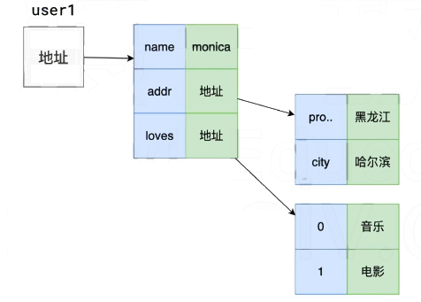
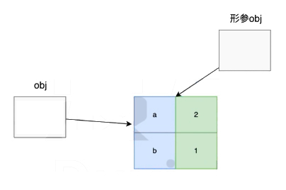

 
# 数据的存储和传递（值和引用）

<!-- more -->
## 直接上代码配合图片理解

### 代码中user1的操作：


### 代码中 交换对象两个属性的值swap


``` javascript
var a = 1; // a值类型，直接在内存里开辟一块空间，里面存的就是值类型1
// b 引用类型
/*
b的操作，{}里面的内容：程序会在内存里开辟一块内存空间，里面存的是键值对，
然后会把这个对象赋值给对象b，其实就是把刚刚开辟的内存地址给b
也就是说，b里面存的其实是一个 内存地址
*/
var b = {
  n1: 1,
  n2: 2
};

/*
c的操作；因为a是值类型，所以会把a里面的值1 复制粘贴存到c里面
*/
var c = a;
c++;
console.log(a, c); // 1 2 ，c++ 不会影响a的值

/* d的操作
因为b是引用类型，所以b变量里面存的其实是一个内存地址，
而把b的值赋值给d，其实是把一个内存地址赋值给了d
那么不管是做 d.n1++ 还是 b.n2++，都是改变内存空间里面的对象，b或d就会一起改变
*/
var d = b;
d.n2++;
console.log(d.n2, b.n2); // 3 3

/* user 的操作：
见图片
*/
var user1 = {
  name: "zhangsan",
  addr: {
    province: "山东",
    city: "青岛"
  },
  love: ["哈啤酒", "吃嘎啦"]
};

/*
同上面d、b的操作，引用类型
address里面存的也是一个内存地址
所以修改的是内存空间里面的对象，user1.addr和address会同时修改
*/
var address = user1.addr;
address.city = "济南";
console.log(user1.addr.city, address.city); // "济南" "济南"
/*
但是如果再给address赋值一个新对象的话,address里面存的就不再是地址了，而是这个新对象
*/
address = {
  province: "四川",
  city: "成都"
};
console.log(user1.addr.city, address.city); // "济南" "成都"

/**
 * 交换两个变量的值
 * @param {*} a 变量1
 * @param {*} b 变量2
 */
function swap(a, b) {
  // 在函数里这么写交换的是形参a、b的值，函数执行结束形参消失，改不了外面的变量
  // var temp = a;
  // a = b;
  // b = temp;
  // 此题用函数实现无解，但是下面 交换对象两个属性的值，就有解，因为是引用类型
}
/**
 * 交换对象两个属性的值
 * @param {Object} obj 对象
 * @param {string} key1 属性名1
 * @param {string} key2 属性名2
 */
function swap(obj, key1, key2) {
  var temp = obj[key1];
  obj[key1] = obj[key2];
  obj[key2] = temp;
} // 原理见图片

/**
 * 交换数组两个位置的值
 * @param {Array} arr 数组
 * @param {number} i1 下标1
 * @param {number} i2 下标2
 */
function swap(arr, i1, i2) {
  var temp = arr[i1];
  arr[i1] = arr[i2];
  arr[i2] = temp;
}
// var arr = [11,22,33,44,55,66];
// swap(arr, 1, 2);
// console.log(arr);  // [11,33,22,44,55,66]

/**
 * 修改对象，仅保留需要的属性
 * @param {Object} obj 要修改的对象
 * @param {Array<string>} keys 需要保留的属性名数组
 */
function pick(obj, keys) {
  for (var key in obj) {
    if (keys.indexOf(key) === -1) {
      delete obj[key];
    }
  }
}
var obj = {
  a: 1,
  b: 2,
  c: 3,
  d: 4,
};
pick(obj, ['a', 'c']);
console.log(obj); //{ "a": 1,  "c": 3 }
```
